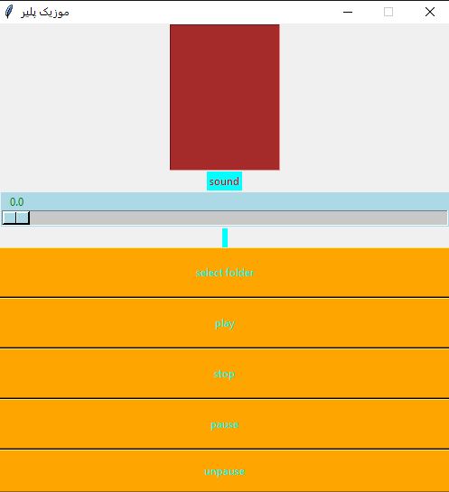

# ⤵️It is an old project for my university.

⬇️I wrote it using python and pygame and tkinter for UI. 

🗃️It does not have a great UI and UX because it is old

  

⚠️First you should open the folder of your music with this app and then you can play it⚠️

