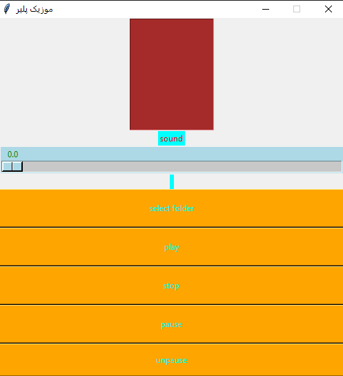

# 🎼A music player project with tkinter.

----
## 🥇Manual
-> create a venv
-> activate it
-> install these

 - typing
 - pygame

## 🎨UI

  

> [!NOTE]  
> First you should open the folder by click on select folder, then find your folder music and select it, in the end you will see list of your musics in that folder and then play.

---

## 👨‍💻Used Technologies
- Python
- Pygame
- Tkinter
- typing 
